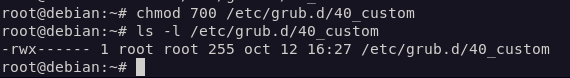
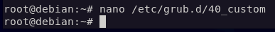
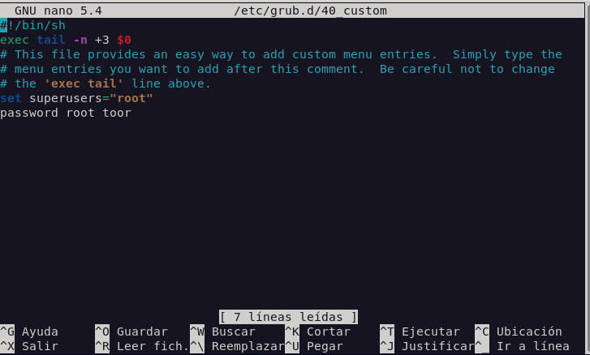
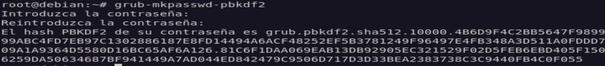
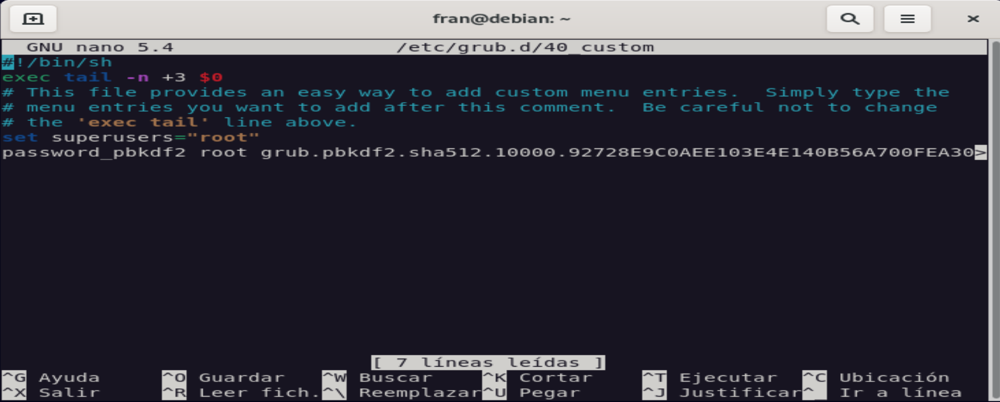
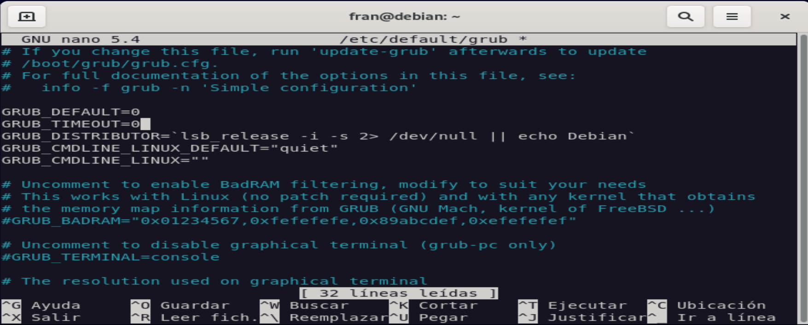

author: Francisco Javier García Cordero
summary: Arranque seguro de un Linux
id: arranque_seguro_grub
categories: codelab,markdown
environments: Web
status: Published

# Arranque seguro de un sistema Linux

## Editar permisos

El primer paso que podriamos dar para asegurar el arranque de nuestro sistema es editar los permisos de los archivos de configuración de GRUB para que solo los pueda editar root. Dejo un ejemplo a continuación.  

## Proteger arranque con contraseña

Para proteger el arranque de nuestro sistema con una contraseña podemos editar e archivo: **"/etc/grub.d/40_custom"**, y luego aplicar los cambios ejecutando **update-grub**

  
  

## Cifrar la contraseña

Para cifrar la contraseña tenemos que ejecutar el comando **"sudo grub-mkpasswd-pbkdf2"** y editar el achivo **"/etc/grub.d/40_custom"** añadiendo la contraseña cifrada y cambiando la palabra **password** por **password_pbkdf2**.  

  
  

## Ocultar el menú de GRUB

Para ocultar el menú de GRUB que nos sale al arrancar nuestro sistema seguiremos los siguientes pasos (siendo root):  

Editamos el archivo **/etc/default/grub**
  
Cambiamos GRUB_TIMEOUT=5 a GRUB_TIMEOUT=0
  
Ejecutamos "update-grub"

## Copia de seguridad de la configuración de arranque

Para realizar una copia de seguridad de la configuracion del arranque de nuestro sistema diferenciaremos dos pasos, aunque para realizar la copia en si solo necesitamos realizar el paso 1, para una restauración completa de GRUB deberemos realizar los dos pasos.

### 1.Copiar archivos

Tenemos que copiar tres archivos: 
El archivo **"/etc/default/grub"** 
El directorio **"/etc/grub.d/"** (y todos los archivos/scripts que contiene) 
El archivo **"/boot/grub/grub.cfg"**

### 2.Reinstalar GRUB

Voy a explicar dos métodos para reinstalar GRUB: 

1. Con un "LiveCD" de Linux, que consiste en usar una distribución en modo LiveCD para instalar nuevamente el GRUB2, usaremos el LiveCD de cualquier distribución que use GRUB2 como gestor de arranque y no Lilo y GRUB1 (por ejemplo, Ubuntu 10.04, Mint8 o Mint9, Guadalinex V7,etc)

 - Un vez dentro del sistema LiveCD, ejecutaremos el comando "fdisk -l" en una terminal para ver las particiones de los distintos discos duros.
 - Despues vemos cual es la partición donde tenemos Linux y la montamos en "/mnt" (normalmente esa partición será "sda1"), por ejemplo: **sudo mount /dev/sda1 /mnt**
 - Si tienes la /boot en partición independiente, despues de montar el sistema de archivos en /mnt (sudo mount /dev/sda1 /mnt), debes montar también la partición /boot con el siguiente comando: **sudo mount /dev/sda2 /mnt/boot**
 - Ahora montamos el resto de dispositivos: **sudo mount --bind /dev /mnt/dev**
 - Ejecutamos el comando chroot de forma que accedemos como root al sistema: **sudo chroot /mnt**
 - Por último cargamos GRUB en el MBR ejecutando el siguiente comando: **grub-install --recheck /dev/sda**
 - (sda lo debemos sustituir por el disco duro que utilicemos para arrancar nuestro sistema operativo, normalmente es **sda**, no poner el número de partición, solo **sda**)
 - Reiniciamos y arrancamos desde el disco duro y no desde el LiveCD, podemos ajustar manualmente el menu de arranque pero lo haremos de forma automatica con el comando: **sudo update-grub2**
 - Si el comando **update-grub2** no te funciona, puede que tengas que instalar el paquete grub2 con el siguiente comando: **sudo aptitude install grub2**

2. Con **Super Grub Disk** (SGD), una aplicación que podemos encotran en "http://www.supergrubdisk.org".

 - Primero nos descargamos la iso de SGD y la grabamos en un CD o en pendrive booteable, reiniciamos y arrancamos desde el CD o el USB
 - Elegiremos la primera opción "Detec any SO", detectara el sistema instalado y mostrara el menu grub con el que arrancas
 - Una vez arrancado el sistema operativo, abrimos un terminal para ejecutar lo siguiente:
   - **sudo grub-mkconfig** (este comando no hace nada, solo nos da una salida de como quedará el fichero grub.cfg)
   - **sudo grub-install /dev/sda** (cuidado!!, puede ser sda o hda, sdb, etc. Teneis que averiguar cuál es el vuestro)
   - **sudo update-grub2**
   - **sudo reboot** y ya tenemos Grub2 sano y salvo
   