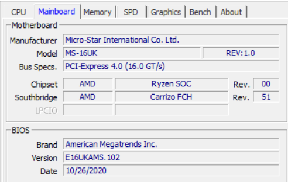
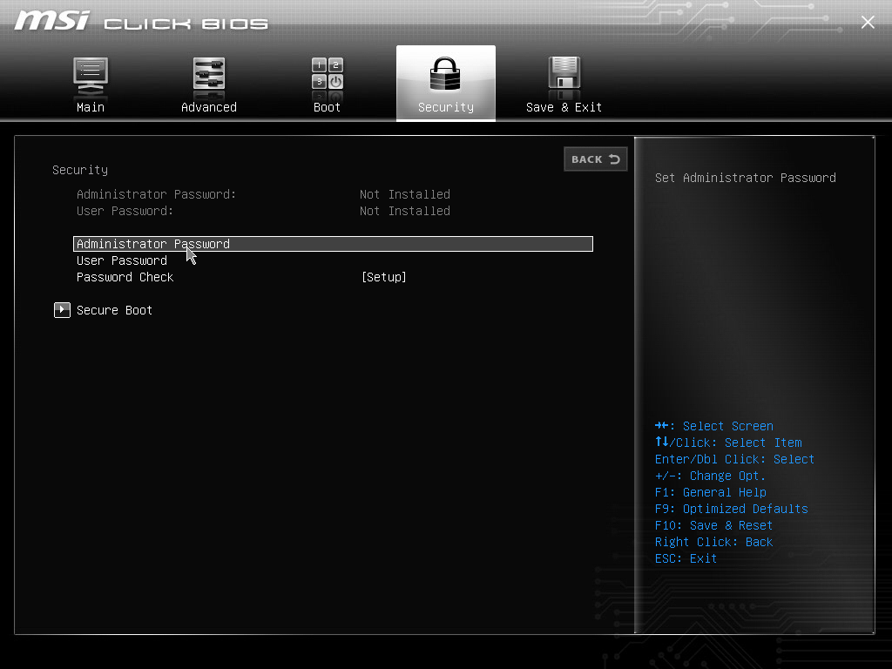
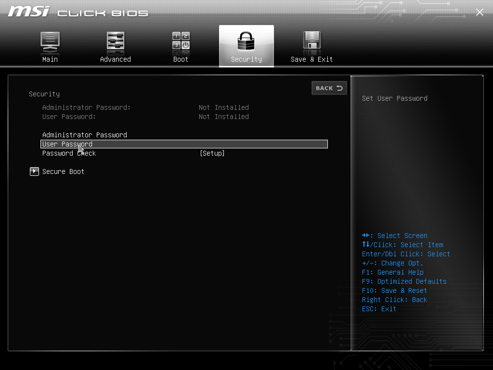
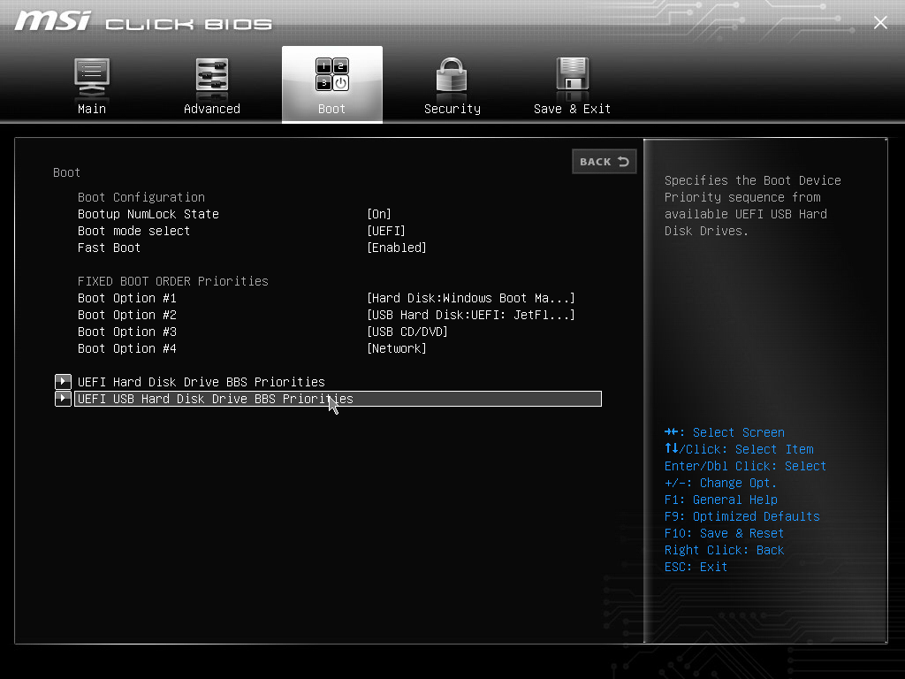
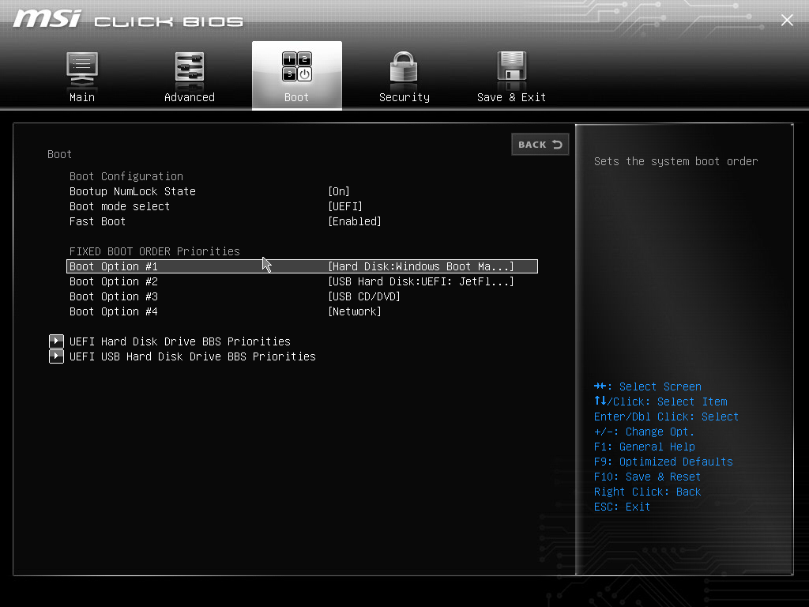
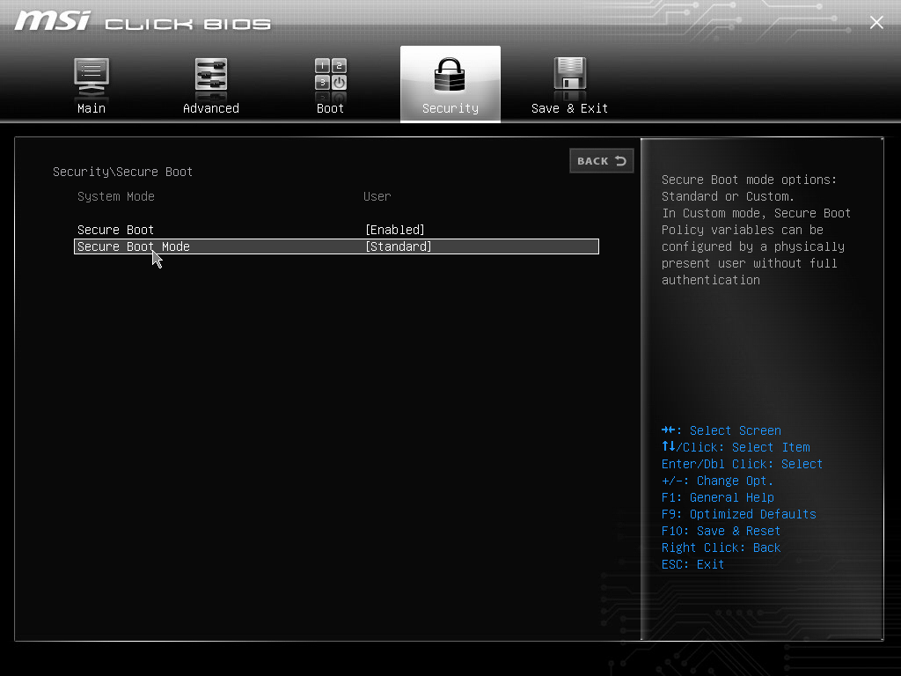

author: Francisco Javier Garcia Cordero
summary: bastionado uefi
id: uefi
categories: codelab,markdown
environments: Web
status: Published

# Bastionado de la UEFI (E16UKAMS.102) incorporada en la placa (MS-16UK)

## Modelo y versión de la UEFI a bastionar y su placa base

## Contraseña de administración de la UEFI

Activaremos esta opción si queremos que el equipo nos solicite una contraseña para modificar los parámetros de la UEFI.

## Contraseña de usuario de la UEFI

Activaremos esta opción si queremos que el equipo nos solicite una contraseña para modificar los parámetros básicos de la UEFI.

## Contraseña de arranque del dispositivo

Activaremos esta opción si queremos que el equipo nos solicite un contraseña para poder arrancar.

## Permiso para el arranque desde dispositivo USB

Activaremos esta opción si queremos poder arrancar el equipo desde un dispositivo extraible a través del puerto USB, por defecto suele venir activada.

## Orden de arranque

Esta opción define el orden en el que se produce el arranque del sistema, es decir, cofiguramos si queremos que primero arranque desde el disco duro y luego pruebe los puertos USB, que compruebe primero USB y luego disco duro, etc.

## Secure Boot

Esta opción deniega la ejecución en el arranque de software no firmado, en general, prohibe la ejecución de cualquier cosa que no sea Windows.
